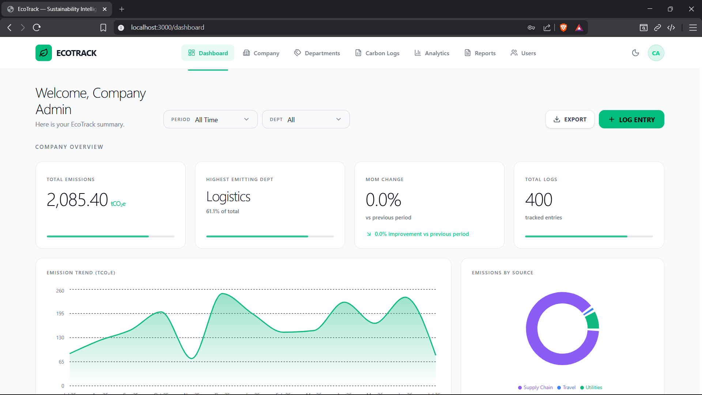

<div align="center">

<br/>

```
███████╗ ██████╗ ██████╗ ████████╗██████╗  █████╗  ██████╗██╗  ██╗
██╔════╝██╔════╝██╔═══██╗╚══██╔══╝██╔══██╗██╔══██╗██╔════╝██║ ██╔╝
█████╗  ██║     ██║   ██║   ██║   ██████╔╝███████║██║     █████╔╝ 
██╔══╝  ██║     ██║   ██║   ██║   ██╔══██╗██╔══██║██║     ██╔═██╗ 
███████╗╚██████╗╚██████╔╝   ██║   ██║  ██║██║  ██║╚██████╗██║  ██╗
╚══════╝ ╚═════╝ ╚═════╝    ╚═╝   ╚═╝  ╚═╝╚═╝  ╚═╝ ╚═════╝╚═╝  ╚═╝
```

### 🌿 Corporate Carbon Emissions Tracking & Sustainability Intelligence Platform

**Measure. Track. Reduce. Repeat.**

<br/>

[](https://react.dev/)
[](https://www.typescriptlang.org/)
[](https://expressjs.com/)
[](https://www.mongodb.com/)
[](https://vitejs.dev/)
[](https://tailwindcss.com/)

<br/>

[🐛 Report a Bug](https://github.com/mohitchauhan21/EcoTrack-Summer-Term-/issues) · [✨ Request a Feature](https://github.com/mohitchauhan21/EcoTrack-Summer-Term-/issues) · [📖 View Docs](#api-reference)

</div>

<br/>

---

## 📸 Dashboard Preview

<div align="center">
  
</div>

---

## 📋 Table of Contents

- [What is EcoTrack?](#-what-is-ecotrack)
- [Features at a Glance](#-features-at-a-glance)
- [Tech Stack](#-tech-stack)
- [System Architecture](#-system-architecture)
- [Project Structure](#-project-structure)
- [Getting Started](#-getting-started)
- [Environment Variables](#-environment-variables)
- [Demo Credentials](#-demo-credentials)
- [Pages & Routes](#-pages--routes)
- [API Reference](#-api-reference)
- [Role-Based Access Control](#-role-based-access-control)
- [Contributing](#-contributing)
- [License](#-license)

---

## 🌍 What is EcoTrack?

**EcoTrack** is a full-stack web platform built to help corporations **measure, monitor, and reduce their carbon footprint** — all from one clean, modern dashboard.

From logging raw emission data and auto-converting it to CO₂e, to generating regulatory-ready Excel reports — EcoTrack gives sustainability teams everything they need in one place.

> **No fluff. Just data, insights, and action.**

Built with a **React 19** frontend and an **Express + MongoDB** backend, it features a premium, theme-aware user interface with fluid micro-animations (Motion), a responsive landing page with an interactive dashboard preview modal, lazy-loaded routes with error boundaries, and a seamless onboarding flow. It includes complete JWT authentication, three-tier role-based access control, interactive Recharts analytics, CSV bulk upload, Excel export, and an in-memory database for zero-setup demos.

---

## ✨ Features at a Glance

| | Feature | What it does |
|---|---|---|
| 🏭 | **Carbon Log Management** | Create, edit, delete & bulk-upload emission entries with inline editing |
| 🧮 | **Auto CO₂e Conversion** | Built-in emission factors for Travel (miles), Utilities (kWh), Supply Chain (kg) — auto-converted to tonnes CO₂e |
| 📊 | **Interactive Analytics** | Recharts-powered emission trend lines, department bar charts, source pie charts & animated KPI cards |
| 📄 | **Excel Report Export** | Export filtered emission data as `.xlsx` spreadsheets via ExcelJS |
| 📤 | **CSV Bulk Upload** | Import hundreds of emission logs at once via CSV file upload (Multer + csv-parser) |
| 🏢 | **Role-Based Access Control** | Three roles — Admin, Executive, Employee — enforced on both frontend routes and backend middleware |
| 🔐 | **Secure Authentication** | JWT tokens, bcrypt password hashing, forgot/reset password flow, show/hide password toggle |
| 🌙 | **Global Theme Engine** | Instant Dark / Light mode toggle synchronized across Landing, Login, Dashboard & all pages |
| ⚡ | **Lazy Loading & Error Boundaries** | All pages are code-split via `React.lazy()` with a custom `ErrorBoundary` for graceful failure recovery |
| 📱 | **Responsive Design** | Mobile-first layout with collapsible sidebar, custom `Select` components & glassmorphism cards |
| 🏠 | **Interactive Landing Page** | Animated marketing page with a live dashboard preview modal |
| 🔄 | **Zero-Setup Dev Mode** | `mongodb-memory-server` auto-spins an in-memory DB with 400+ seeded logs — no MongoDB install needed |

---

## 🛠️ Tech Stack

<details>
<summary><strong>Frontend</strong></summary>

| Package | Version | Role |
|---|---|---|
| `react` + `react-dom` | ^19.0.1 | UI framework |
| `typescript` | ~5.8.2 | Type safety |
| `vite` | ^6.2.3 | Dev server & bundler |
| `tailwindcss` | ^4.1.14 | Utility-first CSS |
| `react-router-dom` | ^7.18.1 | Client-side routing |
| `recharts` | ^3.9.2 | Charts & data visualization |
| `lucide-react` | ^0.546.0 | Icon library |
| `motion` | ^12.23.24 | Animations (Framer Motion) |
| `axios` | ^1.18.1 | HTTP client |
| `date-fns` | ^4.4.0 | Date formatting |
| `clsx` + `tailwind-merge` | latest | Conditional class merging |

</details>

<details>
<summary><strong>Backend</strong></summary>

| Package | Version | Role |
|---|---|---|
| `express` | ^4.21.2 | REST API server |
| `mongoose` | ^9.7.4 | MongoDB ODM |
| `jsonwebtoken` | ^9.0.3 | JWT auth tokens |
| `bcryptjs` | ^3.0.3 | Password hashing |
| `cors` | ^2.8.6 | Cross-origin requests |
| `dotenv` | ^17.4.2 | Environment config |
| `multer` | ^2.2.0 | File upload handling (CSV) |
| `csv-parser` | ^3.2.1 | CSV file parsing |
| `exceljs` | ^4.4.0 | Excel report generation |
| `tsx` | ^4.21.0 | TypeScript execution (dev) |
| `esbuild` | ^0.25.0 | Server bundler (prod) |
| `mongodb-memory-server` | ^11.2.0 | In-memory DB for dev/demo |

</details>

---

## 🏗️ System Architecture

```
┌──────────────────────────────────────────────────────────────────┐
│                         BROWSER                                  │
│                                                                  │
│  React 19 · TypeScript · Vite · TailwindCSS 4 · Recharts        │
│  React Router v7 · Motion · Lucide Icons · Axios                │
│                                                                  │
│  Contexts: AuthContext · ThemeContext · ToastContext · Filter     │
│  Lazy-loaded pages with ErrorBoundary                            │
└─────────────────────────────┬────────────────────────────────────┘
                              │  HTTP / REST  (port 3000)
┌─────────────────────────────▼────────────────────────────────────┐
│                       EXPRESS SERVER                              │
│                                                                  │
│   /api/health        →  Health check                             │
│   /api/auth          →  Register · Login · Me · Password reset   │
│   /api/company       →  GET profile · POST update (admin)        │
│   /api/departments   →  GET list · POST create · DELETE (admin)  │
│   /api/logs          →  CRUD + POST /bulk-upload (CSV)           │
│   /api/analytics     →  Summary · Trend · By-source ·            │
│                         By-department · Export (.xlsx)            │
│   /api/users         →  GET list · POST create · DELETE (admin)  │
│                                                                  │
│   Middleware: requireAuth (JWT) · requireRole (RBAC) · Multer    │
└─────────────────────────────┬────────────────────────────────────┘
                              │  Mongoose ODM
┌─────────────────────────────▼────────────────────────────────────┐
│                         MONGODB                                  │
│                                                                  │
│   Collections: Users · Companies · Departments · EmissionLogs    │
│                                                                  │
│   ⚡ Dev: mongodb-memory-server (auto, seeded with 400+ logs)    │
│   🚀 Prod: MongoDB Atlas via MONGO_URI env variable              │
└──────────────────────────────────────────────────────────────────┘
```

---

## 📂 Project Structure

```
EcoTrack-Summer-Term-/
│
├── 📄 server.ts                    # App entry point — Express + Vite + DB bootstrap
├── 📄 vite.config.ts               # Vite config (React plugin + TailwindCSS)
├── 📄 tsconfig.json                # TypeScript config
├── 📄 package.json                 # Scripts & dependencies
├── 📄 .env.example                 # Environment variable template
├── 📁 public/
│   └── dashboard-preview.png       # Dashboard screenshot for landing page
│
├── 📁 server/                      # ── BACKEND ──────────────────────────────────
│   ├── controllers/                #   Business logic
│   │   ├── authController.ts       #     Register, login, getMe, password reset
│   │   ├── companyController.ts    #     Get & update company profile
│   │   ├── departmentController.ts #     CRUD departments
│   │   ├── logController.ts        #     CRUD emission logs + CSV bulk upload
│   │   ├── analyticsController.ts  #     Summary, trend, by-source, by-dept, export
│   │   └── userController.ts       #     List, create, delete users (admin only)
│   ├── middleware/
│   │   ├── auth.ts                 #     JWT token verification (requireAuth)
│   │   ├── requireRole.ts          #     Role-based access guard (requireRole)
│   │   └── upload.ts               #     Multer file upload config
│   ├── models/
│   │   ├── User.ts                 #     name, email, password, role, companyId, departmentId
│   │   ├── Company.ts              #     name, region (25 countries supported)
│   │   ├── Department.ts           #     name, companyId, active flag
│   │   └── EmissionLog.ts          #     date, activityType, rawAmount, rawUnit, carbonEquivalent
│   ├── routes/
│   │   ├── authRoutes.ts           #     POST register/login, GET me, POST forgot/reset
│   │   ├── companyRoutes.ts        #     GET / POST company
│   │   ├── departmentRoutes.ts     #     GET / POST / DELETE departments
│   │   ├── logRoutes.ts            #     GET / POST / PUT / DELETE + bulk-upload
│   │   ├── analyticsRoutes.ts      #     GET summary/trend/by-source/by-department/export
│   │   └── userRoutes.ts           #     GET / POST / DELETE users
│   ├── scripts/
│   │   └── seedMockData.ts         #     Seeds "Acme Corporation" with 4 depts, 400 logs, 5 users
│   └── utils/
│       └── conversionFactors.ts    #     CO₂e conversion: Utilities→0.475, Travel→0.254, Supply Chain→2.1
│
└── 📁 src/                         # ── FRONTEND ─────────────────────────────────
    ├── App.tsx                     #   Root component — lazy routes + ErrorBoundary + ProtectedRoute
    ├── main.tsx                    #   React DOM entry
    ├── index.css                   #   Global styles & custom animations
    │
    ├── api/
    │   └── axiosClient.ts          #   Preconfigured Axios instance with auth interceptor
    ├── components/
    │   ├── DashboardPreviewModal   #   Interactive dashboard preview (used on landing page)
    │   ├── dashboard/              #   KPI cards, trend chart, pie chart, bar chart, filter bar,
    │   │                           #   employee dashboard view, recent activity, company depts tab
    │   ├── data/                   #   LogsTable (inline edit), ManualEntryForm, CsvUploader
    │   ├── layout/                 #   Navbar, DashboardLayout (sidebar + content)
    │   ├── onboarding/             #   Department tagging step
    │   └── ui/                     #   AnimatedCounter, custom Select component
    │
    ├── constants/
    │   └── regions.ts              #   25 supported countries for company registration
    ├── context/
    │   ├── AuthContext.tsx          #   JWT auth state, login/logout, role-based access
    │   ├── ThemeContext.tsx         #   Dark/Light mode toggling
    │   ├── ToastContext.tsx         #   Toast notification system
    │   └── FilterContext.tsx        #   Dashboard date/department filters
    │
    └── pages/
        ├── LandingPage.tsx         #   Animated marketing page with dashboard preview modal
        ├── DashboardPage.tsx       #   KPI summary with role-based views (admin vs employee)
        ├── ProfilePage.tsx         #   User profile & password management
        ├── OnboardingPage.tsx      #   New company onboarding wizard
        ├── NotFoundPage.tsx        #   Animated 404 page
        ├── auth/
        │   ├── LoginPage.tsx       #   JWT login with validation & password visibility toggle
        │   ├── RegisterPage.tsx    #   Company + user registration with region selection
        │   └── ForgotPasswordPage.tsx
        └── dashboard/
            ├── CarbonLogsPage.tsx      #   Log management — add, edit, delete, bulk upload
            ├── AnalyticsPage.tsx       #   Charts — emission trends, by source, by department
            ├── ReportsPage.tsx         #   Report generation & Excel export
            ├── DepartmentsPage.tsx     #   Department list & management
            ├── CompanyProfilePage.tsx   #   Company profile with departments tab
            └── UsersPage.tsx           #   User management — add, delete, role assignment
```

---

## 🚀 Getting Started

### Prerequisites

| Tool | Minimum Version | Download |
|---|---|---|
| Node.js | 18.x | [nodejs.org](https://nodejs.org/) |
| npm | 9.x | Included with Node.js |
| MongoDB | 6.x *(optional)* | [mongodb.com](https://www.mongodb.com/try/download/community) |

> **No MongoDB?** No problem — skip it entirely. EcoTrack auto-starts an in-memory MongoDB and seeds it with a demo company, 4 departments, 400+ emission logs, and 5 user accounts.

---

### Installation

```bash
# Clone the repository
git clone https://github.com/mohitchauhan21/EcoTrack-Summer-Term-.git
cd EcoTrack-Summer-Term-

# Install dependencies
npm install

# Copy environment template
cp .env.example .env
```

---

## 🔧 Environment Variables

Open `.env` and configure the following:

```env
# ─── Required ─────────────────────────────────────────────────────────────────

# Secret used to sign JWT tokens — use any long random string
JWT_SECRET=replace-with-a-long-random-string

# ─── Optional ─────────────────────────────────────────────────────────────────

# MongoDB connection string (MongoDB Atlas or local)
# Leave EMPTY to use the built-in in-memory database (great for development!)
MONGO_URI=""

# Environment — "development" uses Vite middleware, "production" serves dist/
NODE_ENV=development

# Port the server listens on
PORT=3000

# Public URL of the application (used for self-referential links)
APP_URL=http://localhost:3000
```

---

### Running the App

```bash
# Start in development mode (frontend + backend served together via Vite middleware)
npm run dev
```

Open **[http://localhost:3000](http://localhost:3000)** in your browser. ✅

```bash
# Other commands
npm run build     # Build for production (Vite + esbuild)
npm run start     # Run the production build (node dist/server.cjs)
npm run preview   # Preview the Vite production build locally
npm run lint      # TypeScript type-check (no emit)
npm run clean     # Delete the dist/ folder
```

---

## 🔑 Demo Credentials

When running without `MONGO_URI`, demo data is auto-seeded with the company **"Acme Corporation"** (India region), 4 departments (HR, Sales, Manufacturing, Logistics), and 400+ emission logs. Use any of these accounts:

| Role | Name | Email | Password | What you can do |
|---|---|---|---|---|
| 🟠 **Admin** | Company Admin | `admin@ecotrack.com` | `Password123!` | Full company access — users, departments, logs, analytics, reports |
| 🟡 **Executive** | Executive Viewer | `exec@ecotrack.com` | `Password123!` | View analytics & reports (read-only dashboard) |
| 🟢 **Employee** | John Employee | `employee@ecotrack.com` | `Password123!` | HR department — create & manage emission logs |
| 🟢 **Employee** | Jane Logistics | `jane@ecotrack.com` | `Password123!` | Logistics department — create & manage emission logs |
| 🟢 **Employee** | Alice Mfg | `alice@ecotrack.com` | `Password123!` | Manufacturing department — create & manage emission logs |

---

## 📄 Pages & Routes

| Page | Route | Access | Description |
|---|---|---|---|
| Landing | `/` | Public | Animated marketing page with dashboard preview modal |
| Login | `/login` | Public | JWT authentication with password visibility toggle |
| Register | `/register` | Public | Create company + admin account with region selection |
| Forgot Password | `/forgot-password` | Public | Password reset via email token |
| Onboarding | `/onboarding` | Auth | New company setup wizard (department tagging) |
| Dashboard | `/dashboard` | Auth | KPI summary — different views for admin vs employee |
| Profile | `/dashboard/profile` | Auth | Personal profile & password management |
| Carbon Logs | `/dashboard/logs` | Admin / Employee | Log management — add, edit, delete, CSV bulk upload |
| Carbon Logs — Add | `/dashboard/logs/add` | Admin / Employee | Manual emission log entry form |
| Carbon Logs — Upload | `/dashboard/logs/upload` | Admin / Employee | CSV bulk upload interface |
| Analytics | `/dashboard/analytics` | Admin / Executive | Interactive charts — trends, sources, departments |
| Reports | `/dashboard/reports` | Admin / Executive | Report generation & Excel export |
| Departments | `/dashboard/departments` | Admin | Department creation & management |
| Company Profile | `/dashboard/company` | Admin | Company settings & department overview |
| Users | `/dashboard/users` | Admin | Add, delete users & assign roles |
| 404 | `*` | — | Animated not-found page |

---

## 📡 API Reference

Base URL: `http://localhost:3000/api`

### ❤️ Health — `/api/health`

| Method | Endpoint | Auth | Description |
|---|---|---|---|
| `GET` | `/health` | ❌ | Returns `{ status: "ok" }` |

### 🔐 Auth — `/api/auth`

| Method | Endpoint | Auth | Description |
|---|---|---|---|
| `POST` | `/register` | ❌ | Register a new user + company |
| `POST` | `/login` | ❌ | Authenticate and receive a JWT token |
| `GET` | `/me` | ✅ | Get the currently authenticated user's profile |
| `POST` | `/forgot-password` | ❌ | Request a password reset token |
| `POST` | `/reset-password` | ❌ | Reset password using the token |

### 🏢 Company — `/api/company`

| Method | Endpoint | Auth | Description |
|---|---|---|---|
| `GET` | `/` | ✅ | Get company profile (name, region) |
| `POST` | `/` | ✅ Admin | Update company details |

### 🏬 Departments — `/api/departments`

| Method | Endpoint | Auth | Description |
|---|---|---|---|
| `GET` | `/` | ✅ | List all departments in the company |
| `POST` | `/` | ✅ Admin | Create a new department |
| `DELETE` | `/:id` | ✅ Admin | Delete a department |

### 📋 Emission Logs — `/api/logs`

| Method | Endpoint | Auth | Description |
|---|---|---|---|
| `POST` | `/` | ✅ Admin / Employee | Create a new emission log |
| `GET` | `/` | ✅ Admin / Employee | List emission logs (filterable by department & date) |
| `PUT` | `/:id` | ✅ Admin / Employee | Update a log entry |
| `DELETE` | `/:id` | ✅ Admin / Employee | Delete a log entry |
| `POST` | `/bulk-upload` | ✅ Admin / Employee | Bulk import logs via CSV file upload |

### 📊 Analytics — `/api/analytics`

| Method | Endpoint | Auth | Description |
|---|---|---|---|
| `GET` | `/summary` | ✅ | Total CO₂e, log count, highest emitting dept, period-over-period change |
| `GET` | `/trend` | ✅ | Monthly emission trend data (for line charts) |
| `GET` | `/by-source` | ✅ | Emissions breakdown by activity type (Travel, Utilities, etc.) |
| `GET` | `/by-department` | ✅ | Emissions breakdown by department |
| `GET` | `/export` | ✅ | Download emission data as `.xlsx` Excel file |

> **Query Parameters** (all analytics endpoints): `departmentId`, `startDate`, `endDate`

### 👤 Users — `/api/users`

| Method | Endpoint | Auth | Description |
|---|---|---|---|
| `GET` | `/` | ✅ Admin | List all users in the company |
| `POST` | `/` | ✅ Admin | Create a new user (name, email, role, department) |
| `DELETE` | `/:id` | ✅ Admin | Remove a user from the company |

> All protected routes require the header: `Authorization: Bearer <your_jwt_token>`

---

## 🔒 Role-Based Access Control

EcoTrack uses a **three-tier** RBAC system enforced on both the **frontend** (route guards via `ProtectedRoute` with `allowedRoles`) and the **backend** (`requireRole` middleware):

```
┌─────────────────────────────────────────────────────────────────────┐
│                                                                     │
│  🟠  ADMIN       Full company access                               │
│                  • Manage users (create, delete, assign roles)      │
│                  • Manage departments (create, delete)              │
│                  • Manage emission logs (full CRUD + bulk upload)   │
│                  • View analytics, reports & export data            │
│                  • Update company profile                           │
│                                                                     │
│  🟡  EXECUTIVE   Analytics & reporting access                       │
│                  • View analytics dashboards                        │
│                  • Generate & export reports                        │
│                                                                     │
│  🟢  EMPLOYEE    Department-scoped data entry                       │
│                  • Create, edit, delete own emission logs            │
│                  • Bulk upload emission data via CSV                │
│                  • View personal dashboard                          │
│                                                                     │
└─────────────────────────────────────────────────────────────────────┘
```

---

## 🤝 Contributing

All contributions are welcome! Here's how to get involved:

1. **Fork** the repo
2. **Create** a feature branch  
   ```bash
   git checkout -b feature/your-feature-name
   ```
3. **Commit** your changes using [Conventional Commits](https://www.conventionalcommits.org/)
   ```bash
   git commit -m "feat: add your feature description"
   ```
4. **Push** to your fork  
   ```bash
   git push origin feature/your-feature-name
   ```
5. **Open** a Pull Request against `main`

Please make sure your code passes `npm run lint` before submitting.

---

## 📄 License

This project is licensed under the **Apache 2.0 License**.  
See the [LICENSE](./LICENSE) file for full details.

---

<div align="center">

<br/>

Built with 💚 by [**Mohit Chauhan**](https://github.com/mohitchauhan21) · [**Aman Kumar**](https://github.com/aman08-yadav) · [**Shivam Kumar Singh**](https://github.com/shivam-rajput301)

*If this project helped you, consider giving it a ⭐ — it means a lot!*

<br/>

</div>
